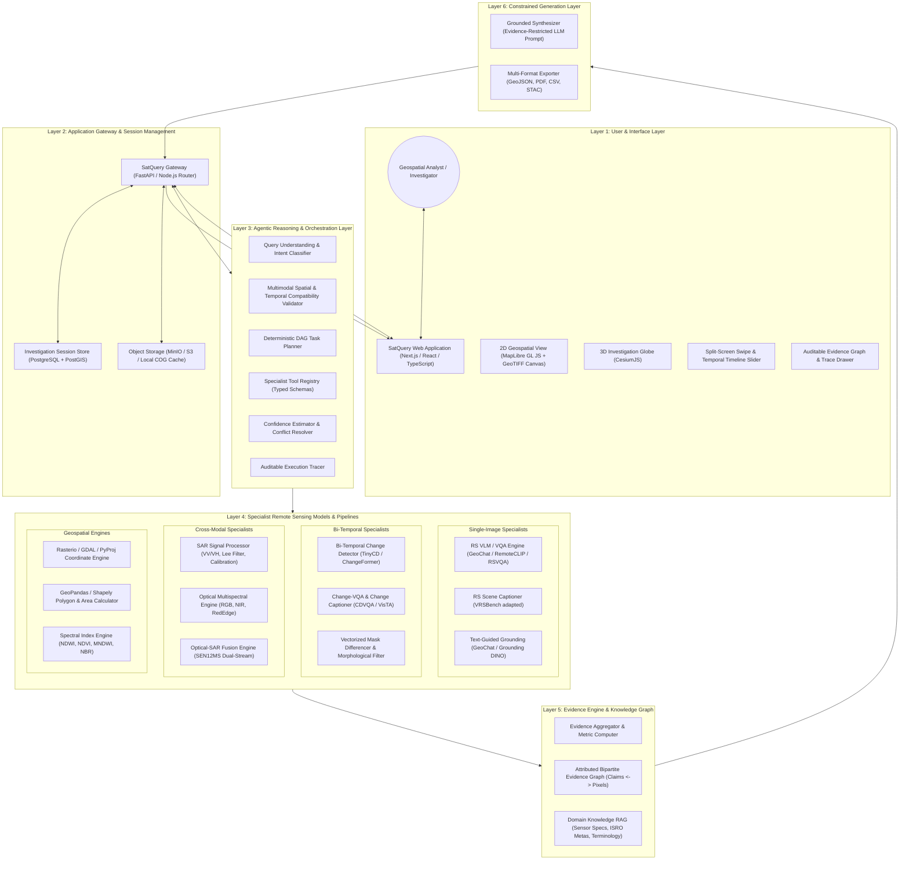
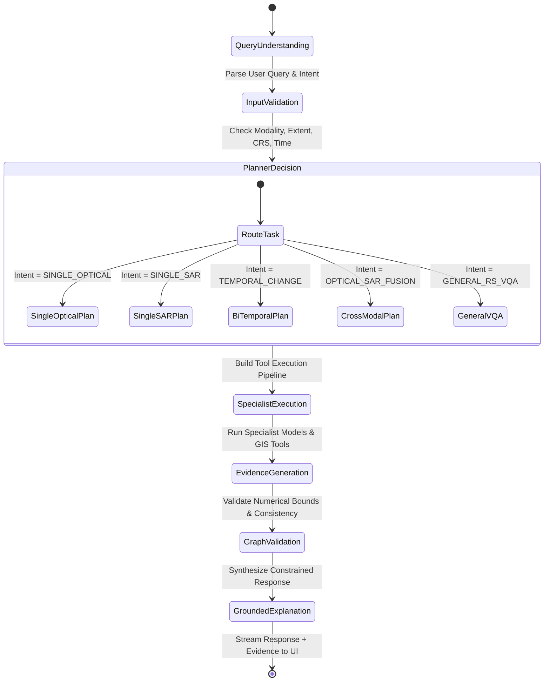

# SatQuery AI — System Architecture Specification
## SIH26167: Multimodal Remote Sensing Vision-Language Investigation Platform
**Target Organization:** Indian Space Research Organisation (ISRO) / Space Applications Centre (SAC)  
**Classification:** Software / Space Technology  
**Version:** 1.0.0-rc1  
**Author:** SatQuery AI Architectural Team

---

## 1. Executive Summary & Core Product Vision

**SatQuery AI** is an **AI-powered geospatial investigation assistant** designed specifically to satisfy the strict scientific and operational demands of Problem Statement **SIH26167** from ISRO. 

Rather than serving as a superficial wrapper around an arbitrary large language model (LLM) or offering ungrounded visual guesses, SatQuery AI implements a **deterministic, evidence-first agentic architecture**. The system treats natural language not as a direct image-decoding oracle, but as a high-level query interface that drives an orchestration pipeline composed of **specialist remote sensing (RS) computer vision models**, **multimodal signal processors**, and **geospatial analytic engines**.

### The Core Anti-Hallucination Axiom
> **"Never allow the LLM to invent visual facts."**

In SatQuery AI:
- **Large Language Models (LLMs)** serve strictly as the **Reasoning, Query-Planning, Tool-Orchestrating, and Explanation Layer**.
- **Specialist Remote Sensing Models & GIS Processors** perform the empirical visual feature extraction, change detection, semantic segmentation, backscatter filtering, and geometric measurement.
- **The Evidence Engine & Evidence Graph** mathematically bridges the two: every textual answer produced by the assistant is bound to verified spatial masks, bounding coordinates, spectral indices, and physical area calculations ($km^2$, hectare, percentage shifts).

```
BAD (VLM Hallucination Paradigm):
Image ──> LLM ──> "I see a flood; the river looks like it expanded by 30%." [UNVERIFIABLE]

GOOD (SatQuery AI Evidence Paradigm):
Image T1 ──> Water Segmentation (NDWI + RS Model) ──> Mask M1 ──> Area: 12.40 km²
                                                                         │
Image T2 ──> Water Segmentation (NDWI + RS Model) ──> Mask M2 ──> Area: 21.82 km²
                                                                         │
M1, M2   ──> Spatial Difference & Connected Components──> Change Mask ───┼──> Evidence Graph ──> Constrained LLM ──> Grounded Answer:
                                                          + Clusters     │    "Water coverage increased by +9.42 km² (+75.97%).
                                                                         │     Major expansion concentrated in North-East sector."
                                                                         ▼
                                                       MapLibre / Cesium Interactive Evidence Overlay
```

---

## 2. High-Level System Architecture

SatQuery AI is organized into seven modular layers operating within a decoupled monorepo architecture:



---

## 3. Detailed Component Breakdown

### 3.1 Layer 1: Geospatial Investigation Interface (Frontend)
The frontend is constructed using **Next.js (App Router), TypeScript, and Tailwind CSS**, styled with a high-density, mission-critical dark theme tailored for defense, scientific, and space applications.

Key interface subsystems:
1. **Interactive Investigation Workspace:** Rather than transient chat sessions, workflows are structured as persistent **Investigations** containing geographic bounds, image assets, timestamps, generated masks, and conversation threads.
2. **Dual 2D / 3D Visualization Canvas:**
   - **MapLibre GL JS Engine:** High-performance vector and raster rendering, dynamic Cloud-Optimized GeoTIFF (COG) overlaying, client-side mask color-ramps, and custom polygon interactions.
   - **CesiumJS 3D Globe:** Inspired by professional spatial platforms (e.g. God's Eye View reference), providing global context, camera coordinate targeting, terrain elevation models, and orbital path references.
3. **Temporal Split & Swipe Comparison:** Interactive before/after split slider allowing analysts to visually corroborate model change predictions against raw bi-temporal imagery.
4. **Interactive Evidence Drawer:** Allows the user to click any claim in the assistant's reply to reveal the exact mathematical lineage:
   - Source images and acquisition metadata
   - Specialist model invocation parameters
   - Raw confidence scores and confusion thresholds
   - Downloadable GeoJSON polygon geometry and area statistics ($m^2 / km^2$)
5. **Report Export Modal:** One-click compilation of comprehensive PDF and GeoJSON mission dossiers.

### 3.2 Layer 2: Application Gateway & Geospatial Store
1. **FastAPI Geospatial Backend:** Handles asynchronous task dispatch, file streaming, WebSocket progress updates, and REST APIs.
2. **PostgreSQL 16 + PostGIS:** Stores investigation metadata, spatial extents, user annotations, and structured audit logs.
3. **Local / Object Storage:** Retains raw input rasters, preprocessed COGs, intermediate inference masks, and serialized JSON evidence graphs.

### 3.3 Layer 3: Agentic Reasoning & Orchestration Subsystem
The orchestration layer coordinates execution without unbounded or non-deterministic code execution loops. It is structured as an **Auditable Directed Acyclic Graph (DAG) State Machine**:



#### The Agent Modules:
- **A. Query Interpreter:** Parses queries using structured entity and intent extraction (e.g. identifying target geographic feature: `water`, `buildings`, `roads`, temporal dimension: `before vs after`, spatial operation: `area`, `location`, `count`).
- **B. Input Compatibility Validator:**
  - *Single Image:* Validates raster sanity (dimensions, channel depth, nodata values, spatial reference system).
  - *Bi-Temporal Images:* Checks coordinate reference system (CRS) compatibility, spatial footprint overlap, resolution differences, and temporal sequencing ($T_1 < T_2$). Auto-reprojects and co-registers if required, logging every geometric transformation.
  - *Cross-Modal Images:* Checks spatial co-registration between Sentinel-2 optical and Sentinel-1 SAR imagery.
- **C. Deterministic Task Planner:** Selects the optimal execution chain from the **Tool Registry** with exact parameter bindings.
- **D. Tool Registry:** Formally typed interfaces for every specialist model and scientific algorithm.
- **E. Specialist Model Executor:** Manages model weights, device placement (CPU vs GPU), batching, and memory cache eviction.
- **F. Confidence & Evidence Aggregator:** Synthesizes raw model outputs into an immutable evidence schema.
- **G. Constrained Explanation Generator:** Injects the evidence graph into a strictly conditioned prompt template that forbids introducing external unverified metrics.
- **H. Auditable Execution Tracer:** Generates an end-to-end execution manifest detailing every tool call, latency, threshold, and parameter for judging and peer review.

---

## 4. Specialist Remote Sensing Subsystems

### 4.1 Single-Image Analysis Subsystem
- **Optical / Multispectral Analysis:**
  - Standard RGB and false-color NIR composite rendering.
  - Spectral index extraction: Normalized Difference Water Index ($NDWI = \frac{\rho_{Green} - \rho_{NIR}}{\rho_{Green} + \rho_{NIR}}$), Normalized Difference Vegetation Index ($NDVI = \frac{\rho_{NIR} - \rho_{Red}}{\rho_{NIR} + \rho_{Red}}$).
- **SAR Analysis:**
  - Sentinel-1 GRD dual-polarization ($\sigma^0_{VV}$, $\sigma^0_{VH}$) backscatter calculation in decibels ($dB$).
  - Enhanced Lee speckle filtering for radiometric noise suppression.
  - Double-bounce urban structure detection and specular water body extraction.
- **Remote Sensing VQA:**
  - Specialist RS VLM (GeoChat / RSVQA-LR/HR) adapted for Earth Observation geometry, zenith angles, and land cover semantics.
- **Captioning & Region Grounding:**
  - Scene-level dense description trained on VRSBench.
  - Text-guided object grounding producing $[x_{min}, y_{min}, x_{max}, y_{max}]$ normalized coordinates and GeoJSON bounding polygons.

### 4.2 Bi-Temporal Change Detection Subsystem
- **Co-Registration Engine:** Verifies spatial alignment using geometric feature matching (ORB/AKAZE on high-gradient edges) and affine raster warping via GDAL/Rasterio.
- **Deep Change Detection Model:**
  - Primary lightweight production model: **TinyCD** (Siamese U-Net with Mix and Attention Mask Block; 0.3M parameters, <2MB footprint, real-time CPU/GPU inference).
  - High-capacity transformer model: **ChangeFormer** (Transformer-based bi-temporal Siamese feature interaction).
- **Physical Area & Differential Quantification:**
  - Vectorization of change masks to GeoJSON polygons with polygon simplification (Douglas-Peucker).
  - Pixel-resolution-aware ground area computation:
    $$\text{Area} = N_{\text{pixels}} \times (\Delta x \times \Delta y) \text{ meters}^2$$
  - Class-specific transition matrices (e.g. Vegetation $\to$ Bare Earth, Water $\to$ Sedimentary Soil).
- **Change VQA & Change Captioning:**
  - Dual-image question answering predicting semantic transitions and temporal modifications (leveraging CDVQA / VisTA benchmark protocols).

### 4.3 Cross-Modal Optical + SAR Analysis Subsystem
- **Problem Addressed:** Optical imagery is vulnerable to cloud obscuration and atmospheric aerosols; SAR imagery provides all-weather cloud-penetrating structural backscatter but lacks spectral land-cover fidelity.
- **SEN12MS-style Dual-Stream Fusion:**
  1. *Optical Stream:* 3/4-band optical reflectance or spectral indices (NDWI, NDVI).
  2. *SAR Stream:* Radiometrically calibrated $\gamma^0$ or $\sigma^0$ VV and VH backscatter with ratio channel ($VV/VH$).
  3. *Feature Fusion Layer:* Cross-attention fusion combining SAR texture/roughness with optical spectral signatures to reliably map water bodies, flooded vegetation, and urban infrastructure even under persistent cloud coverage.

---

## 5. The Evidence Engine & Evidence Graph

Every investigation response is constructed on top of a formal, serializable **Evidence Graph**.

### 5.1 Evidence Schema Definition
```json
{
  "investigation_id": "inv_isro_2026_09a",
  "query": "Has the water-covered area increased between 2020 and 2026?",
  "intent": "TEMPORAL_CHANGE_ANALYSIS",
  "spatial_context": {
    "crs": "EPSG:32644",
    "bbox": [85.31, 27.69, 85.35, 27.73],
    "ground_sample_distance_m": 10.0
  },
  "claims": [
    {
      "claim_id": "c1",
      "statement": "Water-covered area increased significantly from 3.42 km² to 6.18 km² (+80.70%).",
      "status": "VERIFIED",
      "supporting_evidence_nodes": ["node_mask_t1", "node_mask_t2", "node_diff_water"]
    }
  ],
  "evidence_nodes": {
    "node_mask_t1": {
      "type": "BINARY_SEGMENTATION_MASK",
      "timestamp": "2020-03-15T05:30:00Z",
      "model_provenance": "SatQuery-WaterSegmenter-v1 (NDWI + Threshold)",
      "metric": {
        "pixel_count": 34200,
        "area_km2": 3.42,
        "mean_confidence": 0.942
      },
      "raster_uri": "/artifacts/masks/t1_water.tif",
      "vector_geojson_uri": "/artifacts/vectors/t1_water.geojson"
    },
    "node_mask_t2": {
      "type": "BINARY_SEGMENTATION_MASK",
      "timestamp": "2026-03-18T05:30:00Z",
      "model_provenance": "SatQuery-WaterSegmenter-v1 (NDWI + Threshold)",
      "metric": {
        "pixel_count": 61800,
        "area_km2": 6.18,
        "mean_confidence": 0.958
      },
      "raster_uri": "/artifacts/masks/t2_water.tif",
      "vector_geojson_uri": "/artifacts/vectors/t2_water.geojson"
    },
    "node_diff_water": {
      "type": "SPATIAL_DIFFERENCE",
      "operation": "MASK_T2_MINUS_MASK_T1",
      "metric": {
        "delta_area_km2": 2.76,
        "percentage_change": 80.70,
        "primary_centroid": [85.332, 27.712]
      },
      "cluster_count": 3,
      "raster_uri": "/artifacts/masks/delta_water.tif",
      "vector_geojson_uri": "/artifacts/vectors/delta_water.geojson"
    }
  },
  "execution_trace": [
    {"step": 1, "tool": "IMAGE_VALIDATOR", "status": "SUCCESS", "duration_ms": 42},
    {"step": 2, "tool": "CO_REGISTRATION", "status": "ALIGNED", "transformation": "AFFINE_IDENTITY", "duration_ms": 110},
    {"step": 3, "tool": "WATER_DETECTION_T1", "status": "SUCCESS", "duration_ms": 230},
    {"step": 4, "tool": "WATER_DETECTION_T2", "status": "SUCCESS", "duration_ms": 225},
    {"step": 5, "tool": "SPATIAL_STATISTICS", "status": "SUCCESS", "duration_ms": 65},
    {"step": 6, "tool": "EXPLANATION_GENERATOR", "status": "SUCCESS", "duration_ms": 450}
  ],
  "aggregate_confidence": 0.950
}
```

---

## 6. SIH26167 Mandatory Requirements Traceability Matrix

| SIH26167 Mandatory Requirement | SatQuery AI Architectural Solution | Implemented Modules & Tools | Evidence Artifacts |
|:---|:---|:---|:---|
| **1. Single Optical/Multispectral Analysis** | Multi-band GeoTIFF ingestion, RGB/NIR rendering, band composite generator, spectral index engine (NDVI, NDWI, MNDWI). | `apps/api/routers/analyze_single.py`, `models/adapters/spectral.py`, `tools/image_preprocessor.py` | Cloud-Optimized GeoTIFF, Spectral Index Heatmaps, GeoJSON polygons |
| **2. Single SAR Analysis** | Sentinel-1 GRD ingestion, radiometric calibration, Lee speckle filtering, backscatter decibel thresholding, surface roughness & water mapping. | `models/adapters/sar_processor.py`, `tools/sar_analysis.py` | Calibrated $\sigma^0$ raster, Lee-filtered visualization, backscatter histogram |
| **3. Single-Image Visual QA (VQA)** | Remote-sensing adapted vision-language QA conditioned on spatial resolution, sensor characteristics, and terrain features. | `models/adapters/vqa_adapter.py`, `models/adapters/geochat_adapter.py`, `models/adapters/rsvqa_adapter.py` | Text answer, attended spatial bounding box, model confidence score |
| **4. Additional Single-Image Capability: Captioning & Grounding** | **Both implemented**: Dense scene captioning (VRSBench standard) AND text-guided referring expression grounding (coordinates + GeoJSON mask). | `models/adapters/caption_adapter.py`, `models/adapters/grounding_adapter.py` | Descriptive caption string, normalized bounding boxes, GeoJSON vector overlay |
| **5. Bi-Temporal Image Analysis (Change Detection, Description, Change VQA)** | Automatic spatial alignment verification, Siamese change detection (TinyCD / ChangeFormer), quantitative area differencing, and bi-temporal VQA. | `models/adapters/change_adapter.py`, `models/adapters/cdvqa_adapter.py`, `tools/change_engine.py` | Change binary mask, categorical change map, area delta statistics ($km^2$, %), temporal swipe layer |
| **6. Cross-Modal Analysis (Optical + SAR)** | Co-registered Sentinel-1 SAR and Sentinel-2 optical dual-stream fusion for all-weather feature extraction and cloud-resilient water/built-up mapping. | `models/adapters/fusion_adapter.py`, `tools/optical_sar_fusion.py` | Co-registered side-by-side view, cross-modal fused segmentation mask, sensor contribution score |
| **7. Agentic Orchestration & Autonomy** | Query intent parsing, input validation, automatic specialist model selection, parameter configuration, execution tracing, and confidence scoring. | `services/ai/agent/orchestrator.py`, `services/ai/agent/planner.py`, `services/ai/agent/validator.py` | Structured execution DAG, auditable trace logs, step-by-step UI progress bar |
| **8. Remote Sensing Adaptation (BigEarthNet.txt)** | Domain adaptation of vision-language model using BigEarthNet.txt instruction tuning and LoRA parameter-efficient fine-tuning on multi-sensor data. | `evaluation/adaptation/`, `models/adapters/lora_adapter.py`, `scripts/train_adaptation_lora.py` | LoRA adapter weights, Before-vs-After benchmark delta report, loss curves |
| **9. Evidence-Grounded Results** | Strict zero-hallucination constraint: text synthesis strictly derived from quantitative spatial metrics, masks, and bounding boxes in Evidence Graph. | `services/ai/agent/evidence_engine.py`, `services/ai/agent/synthesizer.py` | Evidence Graph JSON, interactive Evidence Drawer, polygon inspection |
| **10. Downloadable Reports** | Automated generation of comprehensive mission dossiers containing geographic context, metadata, methodology, masks, and statistical tables. | `services/geospatial/reporting/report_generator.py` | Interactive PDF Report, GeoJSON FeatureCollection, CSV metrics, STAC Item |
| **11. Rigorous Evaluation Framework** | Quantitative evaluation harnesses benchmarking accuracy against VRSBench, RSVQA, CDVQA, and ISRO-curated spatial scenarios. | `evaluation/runners/`, `evaluation/metrics/`, `evaluation/reports/` | Precision/Recall/F1/mIoU tables, confusion matrices, evaluation dashboard |

---

## 7. Resource Management & Deployment Architecture

To ensure operational viability across standard developer workstations (including CPU fallback environments) and scalable cloud GPU servers:

1. **Lightweight Edge & Fallback Profile:**
   - Change detection runs using **TinyCD** (<2MB weight file, <100ms inference on modern CPU).
   - Water and vegetation extraction runs via vectorized NumPy/Rasterio spectral algorithms ($NDWI, NDVI$).
   - Grounding and detection utilize lightweight quantized ONNX models.
   - Remote sensing VLM runs via 4-bit/8-bit quantized backbones or API-delegated endpoints with strict fallback to local specialist heads.
2. **GPU Acceleration Profile:**
   - Full PyTorch execution of ChangeFormer, GeoChat 7B, and SEN12MS dual-stream deep fusion networks.
   - Dynamic VRAM management: Models are lazily loaded on first invocation, cached with LRU eviction, and cleared from CUDA memory during memory pressure events.
3. **Containerized Monorepo Layout:**
   - Frontend, API, and Worker micro-services deployable together via Docker Compose or separately in Kubernetes/Cloud Run.
